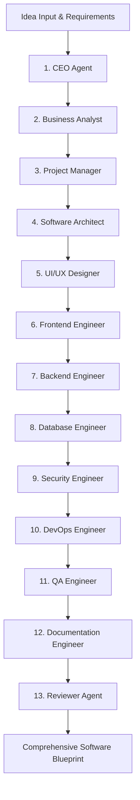

# 🚀 DevCore AI — Multi-Agent Autonomous Software Planning Platform

[](https://devcore-ai.streamlit.app)
[](https://www.python.org/)
[](https://python.langchain.com/)
[](https://groq.com/)

**DevCore AI** is a state-of-the-art multi-agent AI software engineering platform. Describe any software concept or product idea, and a virtual team of **13 specialized AI agents** collaborates to generate an enterprise-grade end-to-end software blueprint, architecture diagrams, database schemas, code templates, and deployment guides.

🔗 **Live Demo**: [devcore-ai.streamlit.app](https://devcore-ai.streamlit.app)

---

## 🌟 Key Features

* **🤖 13 Specialized AI Virtual Agents**: CEO, Business Analyst, Project Manager, Software Architect, UI/UX Designer, Frontend Engineer, Backend Engineer, Database Engineer, Security Engineer, DevOps Engineer, QA Engineer, Documentation Engineer, and Reviewer.
* **⚡ Dual Execution Engine**: Seamlessly switch between lightning-fast cloud inference (**Groq Cloud Llama-3.3-70B**) and 100% offline local models (**Ollama / Qwen3.5**).
* **📚 RAG Knowledge Retrieval**: Upload existing SRS documents, PDFs, DOCX, or markdown files to ground agent outputs in real project requirements.
* **🎨 Custom Neo-Brutalist Dashboard**: Sleek, modern UI powered by Streamlit with custom CSS styling, dynamic agent activity cards, and interactive consultation studios.
* **📦 Export Capabilities**: Package complete software blueprints into structured Markdown ZIP archives or compiled PDF reports.

---

## 🛠️ Tech Stack

- **Frontend & Dashboard**: Streamlit, HTML5, Custom CSS3 (Neo-Brutalist Theme)
- **Multi-Agent Orchestration**: LangGraph, LangChain
- **AI / LLM Providers**: Groq API (Cloud) & Ollama (Local)
- **Database & Persistence**: SQLite3
- **Document Processing & RAG**: PyPDF, python-docx, Sentence Transformers / Vector Store

---

## 🚀 Quick Setup & Installation Guide

Follow these steps to run **DevCore AI** locally on your machine:

### 1. Clone the Repository
```bash
git clone https://github.com/Ranjitpatra26/DevCore-AI-.git
cd DevCore-AI-
```

### 2. Create and Activate a Virtual Environment
```bash
# Windows
python -m venv venv
venv\Scripts\activate

# macOS / Linux
python3 -m venv venv
source venv/bin/activate
```

### 3. Install Dependencies
```bash
pip install -r requirements.txt
```

### 4. Configure Environment Variables
Create a `.env` file in the root directory:
```env
GROQ_API_KEY=your_groq_api_key_here
OLLAMA_URL=http://localhost:11434
EXECUTION_PROVIDER=groq
```

### 5. Launch the Application
```bash
streamlit run app.py
```
Open your browser at `http://localhost:8501` to access the application.

---

## 🏗️ Multi-Agent Architecture



---

## 📄 License & Attribution

This project is built for high-performance software engineering automation and planning. Feel free to star ⭐️ the repository and contribute!
