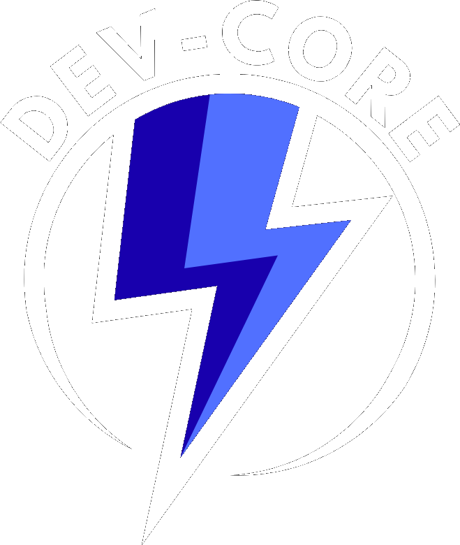
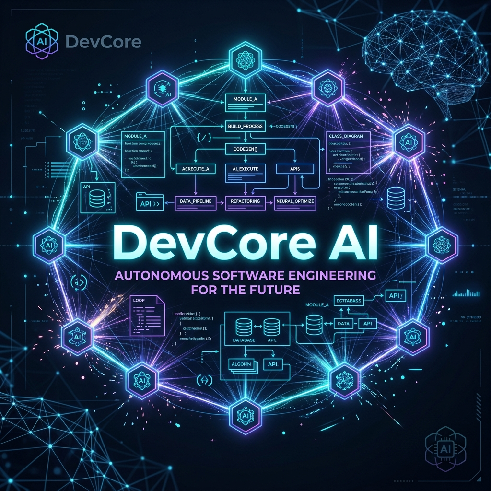
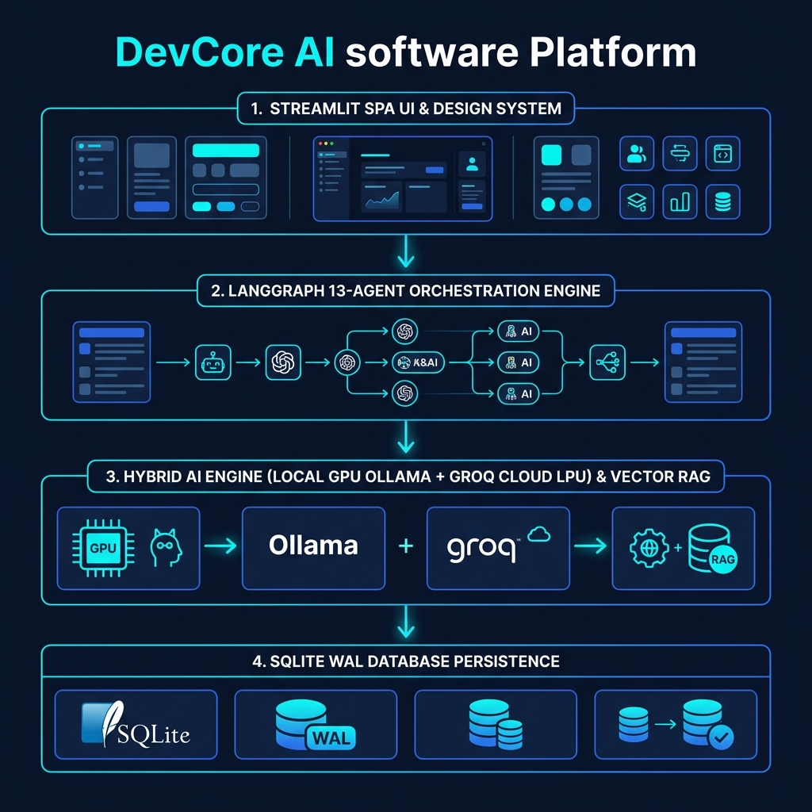
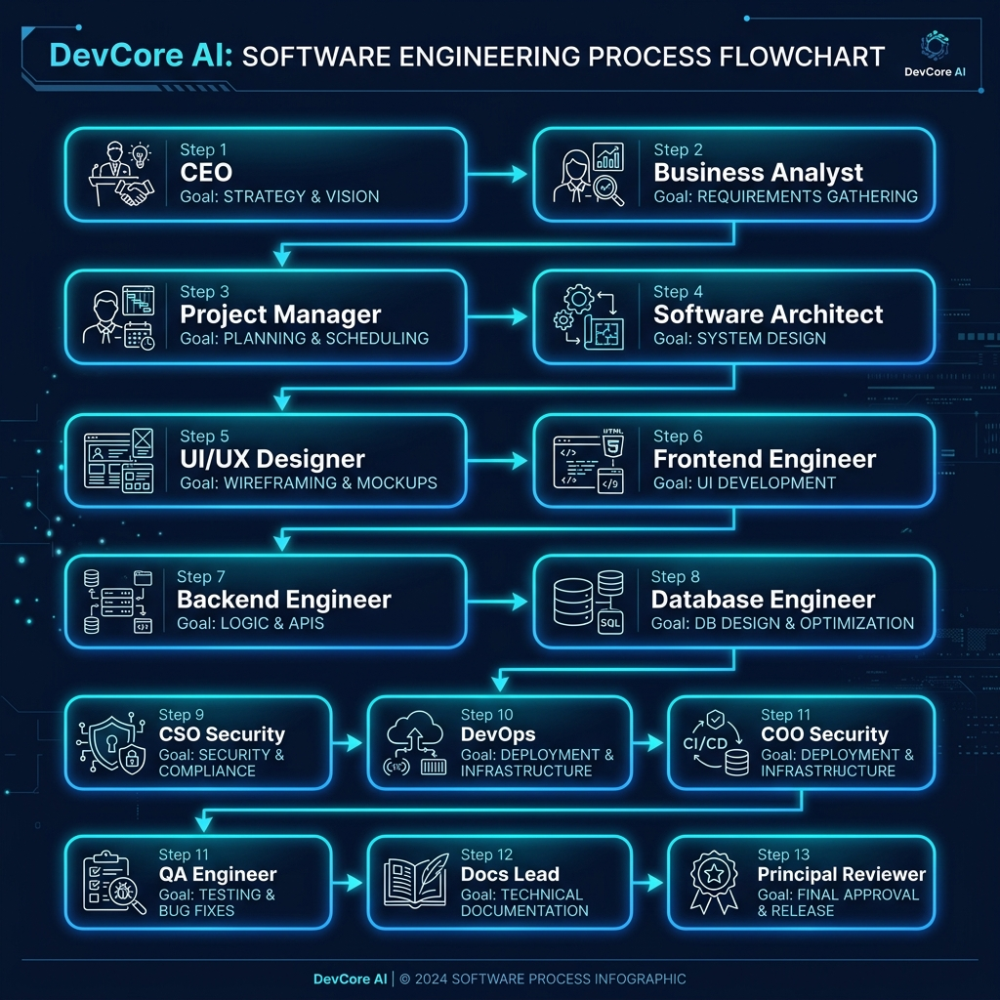
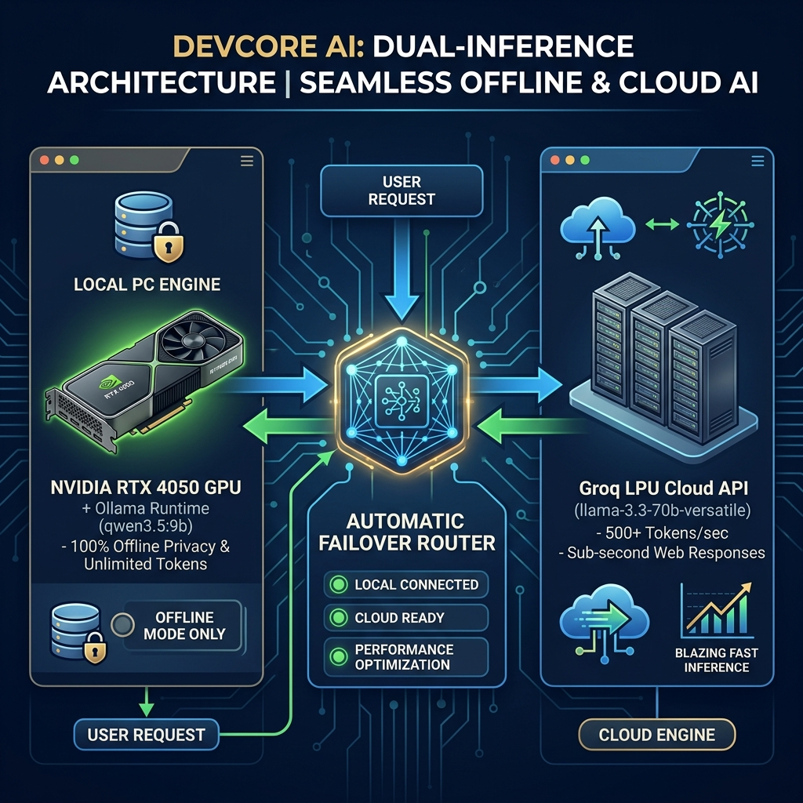
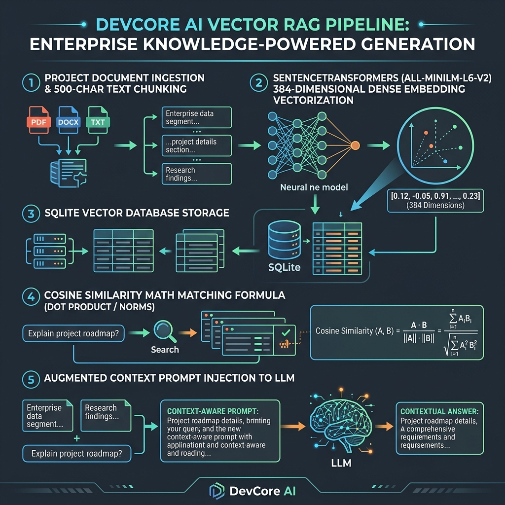

<p align="center">
  <a href="https://devcore-ai.streamlit.app">
    
  </a>
</p>

<p align="center">
  
</p>

<h1 align="center">⚡ DevCore AI — Autonomous Multi-Agent Software Agency</h1>

<p align="center">
  <b>Transform simple software ideas into production-ready software blueprints, architectures, schemas, and code with 13 specialized AI virtual agents working synchronously in your browser.</b>
</p>

<p align="center">
  <a href="https://devcore-ai.streamlit.app">
    
  </a>
  <a href="https://github.com/Ranjitpatra26/DevCore-AI-">
    
  </a>
  <a href="https://www.linkedin.com/in/ranjit-patra/">
    
  </a>
  
  
  
  
  
</p>

<div align="center">

🚀 **[Try the Live Web App](https://devcore-ai.streamlit.app)** &nbsp; | &nbsp; 
📚 **[Implementation Architecture Plan](implementation_plan.md)** &nbsp; | &nbsp; 
👨‍💻 **[Connect on LinkedIn](https://www.linkedin.com/in/ranjit-patra/)**

</div>

---

## 💡 Executive Summary

**DevCore AI** is an enterprise-grade, multi-agent AI software engineering platform. Rather than relying on a single general-purpose chat model to write entire applications, DevCore AI simulates a complete **13-member Virtual Software Engineering Team**. 

From executive strategy down to quality assurance, each agent is an expert trained with hyper-specialized prompts and stateful context memory using **LangGraph**. Give DevCore AI a single prompt like `"Build an AI-powered Telehealth Platform"`, and it will autonomously synthesize:
- Executive Strategy & Business Requirements (BRD/PRD)
- System Architecture & Component Diagrams (Mermaid.js)
- Database Schemas (SQL DDL & ER Diagrams)
- Frontend & Backend Code Scaffolding
- Security Audit & Compliance Specifications
- DevOps Infrastructure (CI/CD, Kubernetes, Docker)
- QA Test Suites & Master User Manuals

---

## 🎨 Visual System Architecture & Design

### 🏛️ 1. Core System Architecture
<p align="center">
  
</p>

### 🔄 2. Multi-Agent Execution Pipeline
<p align="center">
  
</p>

### ⚡ 3. Dual AI Execution Engine (Cloud vs. Local)
<p align="center">
  
</p>

### 🧠 4. RAG Knowledge Retrieval Pipeline
<p align="center">
  
</p>

---

## 🤖 Meet the 13 Specialized AI Virtual Agents

| # | Agent Role | Badge | Core Responsibilities | Output Deliverables |
|:-:|:---|:---|:---|:---|
| **1** | **CEO Agent** | `Strategic` | Vision, market feasibility, monetization, risk analysis | Executive Project Brief & Vision |
| **2** | **Business Analyst** | `Analysis` | User personas, feature prioritization, functional requirements | Detailed PRD & Functional Specs |
| **3** | **Project Manager** | `Management` | Agile roadmap, sprint schedules, resource estimation | WBS, Gantt & Milestone Timeline |
| **4** | **Software Architect** | `System Design` | Technical stack selection, design patterns, microservices | High-Level Architecture & Diagrams |
| **5** | **UI/UX Designer** | `Design` | Design system, wireframes, component hierarchy, accessibility | UX Wireframes & Style Specifications |
| **6** | **Frontend Engineer** | `Client Code` | State management, UI implementation, API integration | React/Next.js/HTML Frontend Code |
| **7** | **Backend Engineer** | `Server Code` | RESTful API design, controller logic, middleware | Node/Python API Server Code |
| **8** | **Database Engineer** | `Data` | ER modeling, indexing, SQL queries, migration scripts | Relational / NoSQL Schemas (DDL) |
| **9** | **Security Engineer** | `Cybersecurity` | Threat modeling, OAuth2/JWT auth, OWASP compliance | Security Hardening Guidelines |
| **10**| **DevOps Engineer** | `Infrastructure` | CI/CD pipelines, Dockerization, cloud hosting configs | Docker, K8s & GitHub Actions Configs |
| **11**| **QA Engineer** | `Testing` | Test strategy, unit test cases, integration tests, E2E | Jest/PyTest Code & Test Plans |
| **12**| **Documentation Engineer** | `Docs` | API documentation, user manuals, installation guides | OpenAPI / Swagger Docs & User Guides |
| **13**| **Reviewer Agent** | `Audit` | Final cross-verification, consistency audit, rating | Master Blueprint Synthesis & Score |

---

## 🔥 Key Technical Capabilities

* **⚡ Dual-Engine Hybrid Inference**:
  * **Cloud Mode (Groq API)**: Ultra-fast Llama-3.3-70B model execution for instantaneous responses.
  * **Local Mode (Ollama)**: 100% private, offline execution using local models (`qwen3.5`, `llama3`, `mistral`).
* **📚 Integrated RAG (Retrieval-Augmented Generation)**:
  * Upload custom PDF, DOCX, TXT, or Markdown requirement documents.
  * Extracted text is chunked, embedded, and injected directly into agent context windows.
  * Features SQLite vector fallback for seamless zero-dependency deployment.
* **🎨 Modern Neo-Brutalist Design System**:
  * High-contrast, vibrant Neo-Brutalist SaaS UI custom-built with Streamlit & CSS.
  * Interactive live agent status cards, micro-interactions, and dark/light theme switching.
* **💬 Agent Consultation Studio & Floating Assistant**:
  * Chat 1-on-1 with any of the 13 agents individually to request code refactoring or architectural modifications.
* **📦 One-Click Enterprise Blueprint Export**:
  * Export complete project blueprints into structured **Markdown ZIP archives** or single **PDF Reports**.

---

## 🎮 How to Use DevCore AI (Step-by-Step User Workflow)

1. **Launch & Select Execution Provider**:
   * Navigate to the **Settings** page or live app ([devcore-ai.streamlit.app](https://devcore-ai.streamlit.app)).
   * Choose between **Cloud (Groq)** for maximum speed or **Local (Ollama)** for total data privacy.
2. **Create a New Software Project**:
   * Go to **New Project** tab.
   * Input your project title, target industry, tech stack preferences, budget, and high-level project description.
3. **(Optional) Upload RAG Context Files**:
   * Attach existing PRD, legacy README, SRS, or specification files (PDF/DOCX/TXT).
4. **Trigger the 13-Agent Execution Pipeline**:
   * Click **Generate Master Blueprint**.
   * Watch real-time agent activity indicators as each of the 13 agents synthesizes its domain-specific outputs.
5. **Review, Consult & Customize**:
   * Browse generated code, Mermaid diagrams, SQL schemas, and test suites in the **Dashboard**.
   * Open the **Consultation Studio** or **Floating Assistant** to ask follow-up questions or refine specific agent outputs.
6. **Export Your Enterprise Blueprint**:
   * Click **Export Blueprint** to download a production-ready `.zip` package containing structured markdown files or compiled PDF report.

---

## 💻 Step-by-Step Installation & Setup Guide

### 📋 Prerequisites
- **Python**: Version `3.10` or higher
- **Git**: Installed on your system
- **Groq API Key** (Optional for Cloud Mode): Free key from [console.groq.com](https://console.groq.com)
- **Ollama** (Optional for Offline Local Mode): Download from [ollama.ai](https://ollama.ai)

---

### Step 1: Clone the Repository
```bash
git clone https://github.com/Ranjitpatra26/DevCore-AI-.git
cd DevCore-AI-
```

### Step 2: Create a Virtual Environment
```bash
# On Windows (PowerShell / Command Prompt)
python -m venv venv
.\venv\Scripts\activate

# On macOS / Linux
python3 -m venv venv
source venv/bin/activate
```

### Step 3: Install Required Dependencies
```bash
pip install -r requirements.txt
```

### Step 4: Setup Environment Variables
Create a `.env` file in the root directory:
```env
# Cloud Execution (Groq)
GROQ_API_KEY=your_groq_api_key_here
EXECUTION_PROVIDER=groq
GROQ_MODEL=llama-3.3-70b-versatile

# Local Execution (Ollama)
OLLAMA_URL=http://localhost:11434
OLLAMA_MODEL=qwen3.5:9b
```

### Step 5: Launch the Application
```bash
streamlit run app.py
```
Visit **`http://localhost:8501`** in your browser to launch DevCore AI.

---

## 📁 Repository Structure

```text
DevCore-AI-/
├── .github/
│   └── workflows/
│       └── keep_alive.yml         # GitHub Actions 24/7 Uptime Cron Job
├── .streamlit/
│   └── config.toml               # Custom Streamlit Server Settings
├── agents/                       # 13 Virtual AI Agent Definitions & System Prompts
│   ├── __init__.py
│   ├── base.py                   # Base Agent Engine
│   └── prompts.py                # Specialized Agent Prompts
├── assets/                       # High-Res Diagrams, Brand Logo & Hero Assets
│   ├── logo.png                  # Official DevCore AI Logo Emblem
│   ├── hero_banner.png           # Hero Banner
│   └── diagrams/                 # Architecture, Pipeline & Engine Diagrams
├── components/                   # Custom Neo-Brutalist UI Components & Modals
│   ├── cards.py
│   ├── implementation_studio.py
│   ├── navigation.py
│   └── chatbot/                  # Floating Chatbot & Groq/Ollama Clients
├── database/                     # SQLite Database Schema & Persistence Manager
│   ├── connection.py
│   └── schema.py
├── exports/                      # Markdown ZIP & PDF Report Generators
├── pages/                        # Multi-Page Streamlit Routes (Dashboard, Projects, AI Team, Chat, Settings)
├── rag/                          # Document Parser & Vector Store Engine
├── styles/                       # Neo-Brutalist & Theme CSS Design Systems
├── utils/                        # Context Builders, Telemetry & Consultation Engines
├── workflow/                     # LangGraph State Machine & Pipeline Graph
├── ai_software_company.db        # Seed SQLite Database
├── app.py                        # Application Entry Point
├── implementation_plan.md        # Technical Implementation & Architecture Specification
├── requirements.txt              # Production Python Dependencies
└── README.md                     # Project Master Documentation
```

---

## ⚙️ Environment Variables Reference

| Variable | Required | Default Value | Description |
|:---|:---:|:---|:---|
| `GROQ_API_KEY` | Optional | `""` | Groq API Key for cloud model inference |
| `EXECUTION_PROVIDER` | Yes | `groq` | `groq` (Cloud) or `ollama` (Local Offline) |
| `GROQ_MODEL` | No | `llama-3.3-70b-versatile` | Active Groq LLM model architecture |
| `OLLAMA_URL` | No | `http://localhost:11434` | Local Ollama endpoint |
| `OLLAMA_MODEL` | No | `qwen3.5:9b` | Local Ollama model name |

---

## ❓ Frequently Asked Questions (FAQ) & Troubleshooting

<details>
<summary><b>Q1: Can I run DevCore AI 100% offline without any internet connection?</b></summary>
<br>
Yes! Download <a href="https://ollama.ai">Ollama</a>, pull your preferred model (e.g., <code>ollama pull qwen3.5:9b</code>), and set <code>EXECUTION_PROVIDER=ollama</code> in your settings or <code>.env</code> file.
</details>

<details>
<summary><b>Q2: What happens if Groq API rate limits are reached?</b></summary>
<br>
DevCore AI includes built-in rate limit detection, exponential backoff retries, and API key quota fallback modals to ensure uninterrupted project generation.
</details>

<details>
<summary><b>Q3: How does the RAG system process uploaded files?</b></summary>
<br>
Uploaded PDF/DOCX/TXT files are parsed into text chunks, stored in an SQLite embedding table, and queried via cosine similarity whenever an agent synthesizes its respective output.
</details>

---

## 🌐 24/7 Cloud Deployment & Uptime Infrastructure

DevCore AI is hosted live on **Streamlit Community Cloud**:
👉 **[devcore-ai.streamlit.app](https://devcore-ai.streamlit.app)**

To bypass Streamlit Cloud's 7-day inactivity auto-sleep policy, the repository incorporates dual automated keep-alive mechanisms:
1. **GitHub Actions Workflow** (`.github/workflows/keep_alive.yml`): Executes an automated HTTP ping every 6 hours.
2. **UptimeRobot Integration**: Continuous 5-minute HTTP uptime check to guarantee immediate responsiveness for visitors.

---

## 👨‍💻 Author & Connect

**Ranjit Patra**  
*AI Systems Architect & Full-Stack Developer*

* 🌐 **Live Web Application**: [devcore-ai.streamlit.app](https://devcore-ai.streamlit.app)
* 💼 **LinkedIn**: [Ranjit Patra](https://www.linkedin.com/in/ranjit-patra/)
* 🐙 **GitHub**: [@Ranjitpatra26](https://github.com/Ranjitpatra26)

---

<p align="center">
  <b>⭐ If you find DevCore AI useful, please consider giving this repository a Star on GitHub! ⭐</b>
</p>
