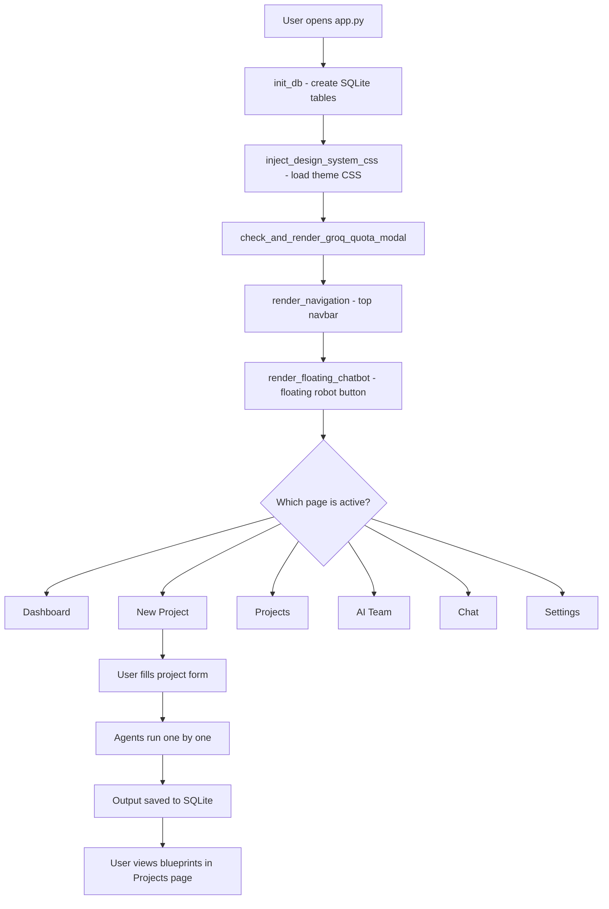

# 🧠 DevCore AI — Complete Project Documentation

> **DevCore AI** is a fully autonomous, Multi-Agent AI Software Engineering Operating System built with Python + Streamlit. It simulates an entire software development company, where specialized AI agents collaborate to plan, architect, and generate production-ready blueprints for any software idea — from idea to deployment spec.

---

## 📁 Project Folder Structure

```
project 2 multi ai/
│
├── app.py                        ← Main Streamlit entry point (SPA router)
├── styles.py                     ← Design system CSS injector
├── styles.css                    ← Global design tokens & layout CSS
├── theme.py                      ← Theme variable definitions
├── requirements.txt              ← Python package dependencies
├── Dockerfile                    ← Container build definition
├── docker-compose.yml            ← Multi-service container orchestration
├── .env                          ← API keys & local environment config
├── ai_software_company.db        ← SQLite persistent database
│
├── pages/                        ← All 6 application pages (SPA routes)
│   ├── dashboard.py              ← Home dashboard
│   ├── new_project.py            ← Create new AI project wizard
│   ├── projects.py               ← Project list & blueprint viewer
│   ├── ai_team.py                ← AI specialist roster
│   ├── chat.py                   ← Direct agent chat console
│   └── settings.py              ← App configuration & API keys
│
├── agents/                       ← AI Agent execution engine
│   ├── base.py                   ← Core agent runner & pipeline orchestrator
│   └── prompts.py               ← All 13 agent system prompts
│
├── components/                   ← Reusable UI components
│   ├── navigation.py             ← Top navbar + theme switcher
│   ├── ui.py                     ← Logo, cards, banners, metric blocks
│   ├── cards.py                  ← Project card renderer
│   ├── groq_quota_modal.py       ← Groq API quota warning modal
│   ├── implementation_studio.py  ← Code generation studio UI
│   └── chatbot/                  ← Floating AI chatbot widget
│       ├── floating_chat.py      ← Chatbot popover trigger button
│       ├── chat_window.py        ← Chat window + message history
│       ├── groq_client.py        ← Groq Cloud API chat client
│       ├── ollama_client.py      ← Local Ollama chat client
│       ├── message_renderer.py   ← Chat bubble renderer (markdown)
│       └── prompt_templates.py   ← Chatbot system prompt templates
│
├── database/                     ← SQLite persistence layer
│   ├── schema.py                 ← Database table creation & seeding
│   └── connection.py             ← Query helpers & theme toggle
│
├── utils/                        ← Core utility modules
│   ├── config.py                 ← All config constants, env loading
│   ├── ollama_client.py          ← Ollama LLM API client (main agents)
│   ├── prompt_builder.py         ← Dynamic prompt assembly
│   ├── blueprint_context.py      ← Blueprint context collector
│   ├── consultation_engine.py    ← Consultation session manager
│   ├── implementation_engine.py  ← Code generation engine
│   ├── telemetry.py              ← Execution tracking & analytics
│   └── validator.py              ← Input validation helpers
│
├── rag/                          ← Retrieval-Augmented Generation
│   ├── vector_store.py           ← Embedding storage & similarity search
│   └── document_loader.py        ← File parsing (PDF, TXT, DOCX)
│
└── styles/
    └── chatbot.css               ← Chatbot-specific CSS
```

---

## 🔄 Application Workflow (Step-by-Step)



---

## 🚀 Entry Point: `app.py`

The **master controller** of the entire application.

| Step | Code | What It Does |
|------|------|------|
| 1 | `st.set_page_config(...)` | Sets browser tab title, icon, layout |
| 2 | `init_db()` | Creates all SQLite tables on first run |
| 3 | `get_current_theme()` | Reads light/dark setting from DB |
| 4 | `inject_design_system_css(theme)` | Injects all CSS variables for the active theme |
| 5 | `check_and_render_groq_quota_modal()` | Shows API quota warning if Groq key is missing |
| 6 | `init_navigation_state()` | Ensures session state has `current_page`, `theme` |
| 7 | `render_navigation()` | Renders top navbar with 6 page buttons |
| 8 | `render_floating_chatbot()` | Renders the floating 🤖 AI chatbot button |
| 9 | Page routing `if page == "Dashboard"` | Calls the right page based on session state |
| 10 | Footer HTML | Shows Ollama & Groq status chips |

---

## 📄 Pages

### 1. `pages/dashboard.py` — `show_dashboard()`
- **Purpose:** Home screen with stats, recent projects, quick-action buttons
- **Shows:** Total projects count, latest blueprints, system status

### 2. `pages/new_project.py` — `show_new_project()`
- **Purpose:** Wizard to create a new AI-planned project
- **Inputs collected:**
  - Project Name, Description
  - Industry (SaaS, FinTech, Healthcare, etc.)
  - Technology preference (Python, Node.js, etc.)
  - Budget (Low / Medium / High)
  - Timeline (1 month MVP, 3 months, 6 months, 12 months)
  - Complexity (Beginner / Intermediate / Advanced / Enterprise)
- **On Submit:** Saves to `projects` table → Triggers all 13 AI agents

### 3. `pages/projects.py` — `show_projects()`
- **Purpose:** List all saved projects, view full agent blueprints
- **Features:**
  - Project cards with metadata
  - Expandable blueprint sections per agent
  - Export to PDF/Markdown
  - Re-run agent buttons
  - File upload for RAG context

### 4. `pages/ai_team.py` — `show_ai_team()`
- **Purpose:** Visual roster of all 13 AI specialist agents
- **Features:**
  - Agent dossier cards (name, role, skills)
  - Click to open a dialog with full agent info
  - "Inspect Raw System Prompt" expander inside dialog
  - "Start Consultation" button to chat directly with an agent

### 5. `pages/chat.py` — `show_chat()`
- **Purpose:** Direct chat interface with any AI agent
- **Modes:** Groq Cloud (fast) or Ollama (local)
- **Features:** Message history, agent selector, streaming responses

### 6. `pages/settings.py` — `show_settings()`
- **Purpose:** Full configuration panel
- **Sections:**
  - AI Engine selector (Ollama / Groq)
  - Groq API key management (4 separate keys for different features)
  - Ollama URL & model selection
  - Temperature, Top-P, Max Tokens sliders
  - Theme toggle
  - Database maintenance tools

---

## 🤖 AI Agents System (`agents/`)

### The 13 AI Specialist Agents

| # | Agent Role | Responsibility |
|---|-----------|----------------|
| 1 | **CEO** | Business vision, revenue model, KPIs, risks |
| 2 | **Business Analyst** | Functional requirements, user stories, use cases |
| 3 | **Project Manager** | Sprint planning, task backlog, roadmap |
| 4 | **Software Architect** | System architecture, tech stack matrix |
| 5 | **UI/UX Designer** | Design system tokens, wireframes, components |
| 6 | **Frontend Engineer** | Component code, state management, CSS |
| 7 | **Backend Engineer** | REST APIs, authentication, business logic |
| 8 | **Database Engineer** | SQL schema, indexes, migrations |
| 9 | **Security Engineer** | STRIDE threats, OWASP, RBAC |
| 10 | **DevOps Engineer** | Dockerfile, CI/CD, Kubernetes, monitoring |
| 11 | **QA Engineer** | Test cases, pytest scripts, load testing |
| 12 | **Documentation Engineer** | README, setup guide, architecture map |
| 13 | **Reviewer Agent** | Cross-reviews all 12 agents, produces master blueprint |

---

### `agents/base.py` — Core Functions

#### `get_role_display_name(role: str) → str`
- Converts internal key (e.g. `"ui_ux"`) to human-readable label (`"UI UX Designer"`)

#### `get_complexity_directives(difficulty, budget, timeline) → str`
- Generates adaptive instruction text based on:
  - **Difficulty:** Beginner / Intermediate / Advanced / Enterprise
  - **Budget:** Low / Medium / High
  - **Timeline:** 1 Month MVP / 3 Months / 6 Months / 12 Months
- Returns a text block injected into every agent's prompt for context-aware output

#### `run_agent(project_id, agent_role, state) → str`
The **core pipeline executor**. Called for each of the 13 agents:

1. **Check cache** → If agent already ran for this project, return saved output (avoids re-running)
2. **Load system prompt** from `SYSTEM_PROMPTS[agent_role]`
3. **RAG query** → `query_project_vector_store()` to find relevant context from uploaded files
4. **Load previous agent outputs** → Passes earlier blueprints as context to next agents
5. **Build user prompt** → Injects project details + complexity directives + RAG + previous context
6. **Query LLM** → `query_ollama()` or falls back to simulated response
7. **Save to SQLite** → Stores markdown output in `agent_runs` table
8. **Log audit entry** → Records execution time in `chats` table

---

### `agents/prompts.py` — System Prompts

Contains `SYSTEM_PROMPTS` dictionary with a unique, detailed instruction prompt for each of the 13 agents. Each prompt:
- Defines the agent's **role and responsibilities**
- Lists **exactly what sections to cover**
- Requires **1,300–2,000 word minimum** output
- Prohibits placeholders or ellipsis (`"..."`)

---

## 🗄️ Database Layer (`database/`)

### SQLite Tables

| Table | Purpose |
|-------|---------|
| `projects` | Stores all project metadata |
| `project_files` | Uploaded files (PDF, TXT, DOCX) per project |
| `agent_runs` | Agent output markdown + execution time |
| `chats` | Chat messages between user and agents |
| `settings` | App configuration (API keys, theme, model) |
| `embeddings` | RAG vector embeddings for uploaded files |

### `database/schema.py` — `init_db()`
- Creates all 6 tables with `CREATE TABLE IF NOT EXISTS`
- Seeds 14 default settings including Ollama URL, model name, Groq API keys, theme

### `database/connection.py` — Core Functions

| Function | What It Does |
|----------|-------------|
| `get_connection()` | Opens SQLite connection with `row_factory` for dict-style rows |
| `execute_query(query, params)` | Runs a SELECT, returns list of dicts |
| `execute_update(query, params)` | Runs INSERT/UPDATE/DELETE, returns rowid |
| `get_current_theme()` | Reads `theme` key from settings table |
| `toggle_theme_db(current_theme)` | Flips light↔dark and saves to DB |

---

## ⚙️ Utils Layer (`utils/`)

### `utils/config.py` — Key Functions

| Function/Constant | Purpose |
|------------------|---------|
| `load_env_file()` | Loads `.env` file + Streamlit Cloud secrets into `os.environ` |
| `update_env_file(key_values)` | Writes new values to `.env` file |
| `ensure_ollama_server_online(url)` | Pings Ollama, auto-launches `ollama serve` if offline |
| `get_generation_config(override)` | Returns full model config dict (url, model, temp, tokens) |
| `get_execution_provider()` | Returns `"ollama"` or `"groq"` from settings DB |
| `AGENT_BLUEPRINT_MAX_TOKENS = 8192` | Token limit per agent (deep generation) |
| `DEFAULT_REQUEST_TIMEOUT = 360` | 6-minute max request timeout |

### `utils/ollama_client.py`
- Main LLM API client for local Ollama server
- `query_ollama(system_prompt, user_prompt, agent_role, override_max_tokens)`
- Handles retries, fallback models, and simulated responses on failure

### `utils/prompt_builder.py`
- Assembles dynamic prompts from project state + RAG context + previous agent outputs

### `utils/implementation_engine.py`
- Powers the **Implementation Studio** (actual code file generation)
- Streams code generation responses for selected blueprint sections

### `utils/consultation_engine.py`
- Manages back-and-forth consultation sessions with individual agents

### `utils/telemetry.py`
- Tracks execution metrics (time per agent, token counts, provider used)

### `utils/validator.py`
- Input validation for forms (project name, API keys, URLs)

---

## 📚 RAG System (`rag/`)

RAG = **Retrieval-Augmented Generation** — lets agents reference your own uploaded documents.

### `rag/document_loader.py`
- Parses uploaded files: PDF, TXT, DOCX
- Chunks text into sections for embedding

### `rag/vector_store.py`
- `query_project_vector_store(project_id, query, top_k=5)` 
  - Converts query to embedding vector
  - Performs cosine similarity search against stored embeddings
  - Returns top-K most relevant text chunks
- Embeddings stored in `embeddings` SQLite table as JSON

---

## 🧩 Components (`components/`)

### `components/navigation.py`
| Function | What It Does |
|----------|-------------|
| `init_navigation_state()` | Sets `current_page`, `active_project_id`, `theme` in session state |
| `render_navigation()` | Draws top navbar: Logo + 6 page buttons + floating theme toggle |

### `components/ui.py`
- `render_logo()` → Returns branded HTML logo string
- Metric cards, stat blocks, section banners, dividers

### `components/cards.py`
- `render_project_card(project)` → Renders a styled project summary card

### `components/groq_quota_modal.py`
- `check_and_render_groq_quota_modal()` → Shows a warning modal if Groq API key is missing or quota exceeded

### `components/implementation_studio.py`
- The full **Implementation Studio UI** — lets users select blueprint sections and generate real source code files

### `components/chatbot/`

| File | Function |
|------|----------|
| `floating_chat.py` | `render_floating_chatbot()` — renders the 🤖 FAB button + popover |
| `chat_window.py` | Full chat message thread, input box, send button |
| `groq_client.py` | Streams responses from Groq Cloud API |
| `ollama_client.py` | Queries local Ollama model for chatbot replies |
| `message_renderer.py` | Renders chat bubbles with markdown formatting |
| `prompt_templates.py` | System prompt templates for chatbot personality |

---

## 🎨 Styling System

### `styles.py` — `inject_design_system_css(theme)`
- Injects the entire CSS design system into the Streamlit app
- Reads `styles.css` and `styles/chatbot.css`
- Applies theme-specific CSS variables (`--primary-color`, `--bg-color`, etc.)

### `styles.css`
- **1,500+ lines** of custom CSS
- Neo-Brutalist design language: bold borders, offset shadows, strong typography
- Desktop layout, responsive breakpoints, animations
- Mobile media queries (`@media (max-width: 768px)`) for all components

### `styles/chatbot.css`
- All chatbot-specific styles
- Mobile overrides for the floating 🤖 button positioning and centering

---

## 🔑 Environment Variables (`.env`)

| Variable | Purpose |
|----------|---------|
| `GROQ_API_KEY` | Default Groq Cloud API key |
| `GROQ_API_KEY_BLUEPRINT` | Key used for blueprint agent generation |
| `GROQ_API_KEY_STUDIO` | Key used for Implementation Studio |
| `GROQ_API_KEY_CHATBOT` | Key used for floating chatbot |
| `GROQ_API_KEY_CONSULTATION` | Key used for agent consultations |
| `OLLAMA_URL` | URL of local Ollama server (default: `http://localhost:11434`) |
| `EXECUTION_PROVIDER` | `ollama` or `groq` |

---

## 🐳 Deployment

### Local Development
```bash
pip install -r requirements.txt
streamlit run app.py
```

### Docker
```bash
docker-compose up --build
```

### Streamlit Cloud
- Push to GitHub → Connect repo on share.streamlit.io
- Add secrets in Streamlit Cloud dashboard (replaces `.env`)

---

## 📊 Data Flow Summary

```
User Input (New Project Form)
        ↓
 Save to projects table (SQLite)
        ↓
 run_agent() × 13 agents (sequential)
    ├── Load system prompt
    ├── Query RAG vector store (uploaded docs)
    ├── Load previous agent outputs as context
    ├── Build final user prompt
    ├── Query Ollama / Groq LLM
    └── Save markdown output to agent_runs table
        ↓
 User views blueprints (Projects page)
        ↓
 Optional: Implementation Studio → Generate code files
        ↓
 Optional: Export as PDF / Markdown
```

---

## 🛡️ Tech Stack

| Layer | Technology |
|-------|-----------|
| **Frontend** | Streamlit (Python) |
| **Styling** | Vanilla CSS (Neo-Brutalist design) |
| **Local LLM** | Ollama (qwen3.5:9b model default) |
| **Cloud LLM** | Groq Cloud API (llama-3.3-70b-versatile) |
| **Database** | SQLite3 |
| **RAG/Embeddings** | Custom cosine similarity vector store |
| **Containerization** | Docker + docker-compose |
| **Deployment** | Streamlit Cloud |

