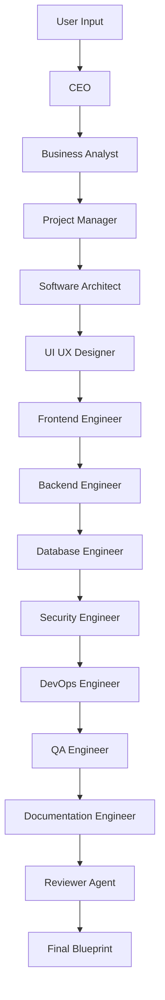

# Implementation Plan - AI Software Company

"AI Software Company" is an AI-powered Software Planning Platform. Users describe a software idea, and the platform creates an entire software blueprint using multiple collaborating AI Agents: CEO, Business Analyst, Project Manager, Software Architect, UI/UX Designer, Frontend Engineer, Backend Engineer, Database Engineer, Security Engineer, DevOps Engineer, QA Engineer, Documentation Engineer, and a Reviewer.

The platform runs 100% locally using **Ollama** (defaulting to model `qwen3:8b` or whichever local model is configured). The UI is built using **Streamlit** styled as a high-end, responsive **Neo-Brutalist** SaaS dashboard, completely hiding default Streamlit components.

---

## Technical Stack & Architecture

- **Frontend**: Streamlit styled with custom HTML, CSS (Neo-Brutalist styling), and JS.
- **Backend**: Python (clean architecture).
- **Orchestration**: LangGraph and LangChain (using LangChain's Ollama integration).
- **Database**: SQLite (projects, outputs, chats, files, configurations).
- **RAG**: SQLite fallback + ChromaDB with Sentence Transformers (for context extraction from uploaded SRS/README/documentation).
- **Exports**: Markdown (ZIP), PDF (using reportlab), JSON, and Mermaid.js diagrams.

---

## Directory Structure

```text
/c:/Users/RANJIT PATRA/OneDrive/Attachments/project 2 multi ai
├── app.py                  # Main entrypoint for Streamlit
├── styles/
│   └── neobrutalism.css    # Neo-Brutalist style definitions
├── database/
│   ├── __init__.py
│   ├── connection.py       # SQLite connection manager
│   └── schema.py           # DB tables schema & migrations
├── rag/
│   ├── __init__.py
│   ├── document_loader.py  # PDF, DOCX, TXT, MD parser
│   └── vector_store.py     # Embedding builder & SQLite-based Vector fallback
├── agents/
│   ├── __init__.py
│   ├── base.py             # Base agent definition
│   └── prompts.py          # Custom system prompts for all 13 agents
├── workflow/
│   ├── __init__.py
│   ├── state.py            # Shared State definition
│   └── graph.py            # LangGraph pipeline definition
├── exports/
│   ├── __init__.py
│   ├── markdown.py         # Markdown zip packager
│   └── pdf_generator.py    # ReportLab PDF compiler
├── components/
│   ├── __init__.py
│   ├── cards.py            # Neo-Brutalist custom card templates
│   └── navigation.py       # Custom header, sidebar, and status indicator
└── utils/
    ├── __init__.py
    ├── logger.py           # Standardized logger
    └── ollama_client.py    # Custom Ollama wrapper with failover
```

---

## SQLite Database Schema

We will use SQLite to persist all data. The tables include:
1. `projects`: Stores project metadata (id, name, description, industry, tech_preference, budget, timeline, difficulty, model_used, created_at).
2. `project_files`: Stores uploaded RAG files (id, project_id, filename, file_type, content, uploaded_at).
3. `agent_runs`: Stores outputs and execution stats for each agent per project run (project_id, agent_role, output_markdown, execution_time_s, timestamp).
4. `chats`: Stores chat conversations with individual agents (id, project_id, agent_role, sender, message, timestamp).
5. `settings`: Global configuration options stored locally (key, value).
6. `embeddings`: Stores RAG document chunks and embeddings (id, file_id, chunk_text, embedding_vector_json).

---

## LangGraph Multi-Agent Collaboration Workflow

We will construct a stateful LangGraph workflow where each agent is a node. The state flows sequentially from CEO to Reviewer, updating the shared state:


### Shared State Attributes
- `project_id`, `project_name`, `description`, `industry`, `tech_preference`, `budget`, `timeline`, `difficulty`
- `rag_context`: Retrived documents context
- `agent_outputs`: Dictionary mapping agent roles to their markdown blueprints
- `current_agent`: Currently active agent role
- `logs`: Audit log of the run
- `model_name`: The active Ollama model name

---

## UI Styles (Neo-Brutalisim)

We will override the default Streamlit theme using a custom CSS file injected into the page:
- **Bold Borders**: `border: 4px solid #111827;`
- **Drop Shadows**: `box-shadow: 4px 4px 0px 0px #111827;`
- **Typography**: Primary Google Font: `Outfit`, fallback `sans-serif`. Huge headers.
- **Button Micro-interactions**: Smooth scaling and transition on hover.
- **Sleek Gradients & Backgrounds**: Base background `#F6F6F6`, accents in deep primary blue (`#2563EB`), vibrant purple (`#8B5CF6`), and warning yellow (`#FACC15`).
- **Complete Branding Hiding**: Hiding the Streamlit menu, header, and footer completely.

---

## RAG Design (Robust SQLite fallback)

If standard vector database installations fail (due to compilation issues on modern Python or Windows environments), we will employ an SQLite-based vector store that:
1. Chunks files using a Recursive Character Text Splitter.
2. Extracts embeddings using a lightweight local embedding (like custom TF-IDF/Sentence-Transformers) or by querying Ollama's local `/api/embeddings` endpoint.
3. Saves embeddings into the sqlite database as JSON arrays.
4. Performs cosine similarity queries inside Python to retrieve document chunks matching the query.
5. Injects matching context into the prompt templates.

---

## Open Questions

> [!NOTE]
> 1. **Default Ollama URL**: The app assumes Ollama is listening at `http://localhost:11434`. Please ensure your Ollama service is running.
> 2. **Ollama Model**: We will make the active model selectable from the Settings menu. The default model is `qwen3:8b`, but we will provide fallback suggestions like `llama3`, `mistral`, or `qwen2.5:7b` in case `qwen3:8b` is not installed on your system.

---

## Verification Plan

### Automated Tests & Runs
- Create a test script in `scratch/test_pipeline.py` to trigger the Multi-Agent state machine with a mock project idea and check that each node successfully writes its output to SQLite.
- Run the Streamlit application and verify the UI aesthetics.

### Manual Verification
- Start the server using: `streamlit run app.py`
- Create a new project, upload a sample README/TXT file, and run the blueprint generation.
- Check generated blueprints on the dashboard, run interactive agent chats, and download export files (Markdown ZIP, PDF).
